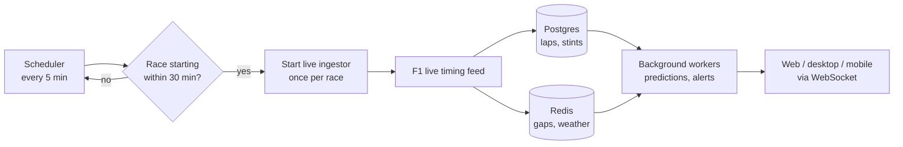

# Features

A tour of what the F1 Strategy Engine does, feature by feature. It's written for
someone who wants to see the product before reading the code. Each section says
what you see on screen, how it works underneath, and any limitations.

For why the system is built the way it is, see [architecture.md](architecture.md).
For the machine-learning models behind the predictions, see [ml-models.md](ml-models.md).

> **Running it:** the backend runs locally for now (Docker Compose). A cloud
> deployment is planned. See the [README's Quick Start](../README.md#quick-start-local-development).

## Contents

1. [Race page: timing tower, circuit map and lap data](#1-race-page-timing-tower-circuit-map-and-lap-data)
2. [Pit-window recommendations](#2-pit-window-recommendations)
3. [Undercut and overcut threats](#3-undercut-and-overcut-threats)
4. [Alerts](#4-alerts)
5. [What-If Strategy Simulator](#5-what-if-strategy-simulator)
6. [Driver analytics](#6-driver-analytics)
7. [Demo Replay](#7-demo-replay)
8. [Automatic race detection and live ingestion](#8-automatic-race-detection-and-live-ingestion)
9. [Dashboard and landing page](#9-dashboard-and-landing-page)
10. [Desktop app](#10-desktop-app)
11. [Mobile app](#11-mobile-app)

---

## 1. Race page: timing tower, circuit map and lap data

The main race view. It follows a live race while one is running and falls back
to the most recent completed race otherwise.

**What you see**
- **Timing tower** (left): running order, gap to the leader, and a tyre icon
  showing each driver's current compound. Lapped cars switch from a time gap to
  "+1 LAP", the way official timing screens do.
- **Circuit map** (centre): the track outline with a team-coloured dot per
  driver, animating around the lap. Selecting a driver syncs the map, the tower
  and the charts.
- **Lap time chart:** the selected driver's lap times, coloured by tyre compound,
  with pit stops marked.
- **Sector heatmap:** every driver's sector and lap times, using the broadcast
  colour code: purple for the session best, green for a personal best, yellow
  for slower.
- **Strategy panels** (right): the selected driver's pit window and undercut
  threats (sections 2 and 3), plus a "strategy wall" with a compact pit-window
  card for every driver in the field.

**How it works:** lap completions reach the browser over a WebSocket. The
backend fans each event out once per session, so extra viewers don't add
database or cache load. Circuit outlines come from FastF1 position data, stored
once per circuit.

**Limitations:** the speed, throttle, brake and gear gauge on the map only fills
in with car telemetry, and F1's live feed sends that only to authenticated F1TV
subscribers, which this project doesn't use. During a live race without F1TV
access, the dots and gauge have no data. Timing, tyres, gaps and sectors are
unaffected.

---

## 2. Pit-window recommendations

For any driver: when to pit, onto which tyre, and how confident the model is.

**What you see**
- A recommended pit window (for example "Lap 22–26") and a single recommended lap.
- The recommended compound for the next stint.
- A confidence score.
- A plain-English explanation of which factors drove the recommendation.
- The lap the prediction was made on. During a race it updates every lap.

**How it works**
- A tyre-degradation model per compound (XGBoost) projects how much slower each
  lap gets as the tyres wear.
- A pit predictor (LightGBM) estimates the chance the driver pits within the
  next 3 laps, from tyre age, predicted tyre life, gaps to the cars around them,
  safety-car probability and race position.
- The explanation comes from SHAP values, which break a single prediction down
  into how much each input contributed.
- Predictions are computed in background workers on every completed lap and
  cached, so the page never waits on the models.

**Limitations:** the models learn from past races (2018 onward, race sessions
only). They pick up typical strategy patterns but can't see team-specific plans,
driver instructions or damage.

---

## 3. Undercut and overcut threats

For the selected driver, two numbers about the cars directly around them:

- **Opportunity (car ahead):** the chance of passing the car ahead by pitting
  first (an undercut).
- **Threat (car behind):** the chance the car behind gains the position if they
  pit now.

In live mode the panel also shows the projected time gained or lost and a
suggested action.

**How it works:** the tyre-degradation models project both drivers' next stint
(one on fresh tyres, one staying out on worn ones). The gap between them and the
time lost in the pit lane are then compared across simulated outcomes to produce
a probability.

**Limitations:** this score is still being calibrated against historical pit
stops. So far, a simple estimate based on the gap between the two cars predicts
real undercut outcomes better than the model does, so the plan is to switch to a
calibrated gap-based probability. Treat the current number as a guide, not a verdict.

---

## 4. Alerts

A notification is raised when a driver comes under a strong undercut threat
during a race.

**What you see**
- An **Alerts** page with the full history, which you can mark as read.
- A **Recent Alerts** feed on the dashboard.
- A **notification settings** panel to choose which alert types and which drivers
  you care about. Drivers are grouped by team, with select-all per team.

**How it works:** each time a prediction is saved, the backend re-checks every
pair of adjacent cars. Alerts that cross the threshold are stored and pushed to
connected clients in real time. Repeats of the same alert are suppressed for a
short window so a persisting threat doesn't spam you. Alerts are also held back
when they wouldn't make sense: a car that has stopped, tyres fitted the lap
before, or too few laps left to make a stop worthwhile.

**Limitations:** the subscription form lists five alert types, but only
**undercut threat** alerts are generated today. Mobile push notifications are
built but untested on a real device.

---

## 5. What-If Strategy Simulator

Ask "what happens if I pit on lap 30 instead of 33?" and get an answer as a range
of outcomes, not a single guess.

**What you set**
- The race and driver. It defaults to the most recent completed race when
  nothing is live.
- The current lap, laps remaining, current tyre compound and tyre age.
- Then one of two modes:
  - **Single Plan:** a full strategy with one or more planned stops (lap +
    compound). Leave it empty to let the model decide.
  - **Compare Scenarios:** up to 4 candidate pit laps side by side, each with
    its own compound and optional label.

**What you get back**
- Predicted positions gained or lost, predicted finish time and its likely
  range, for each strategy.
- A **finishing-position distribution** chart: how likely each final position
  is, one bar series per scenario. It comes with a table of the chance to gain,
  hold or lose places.
- A **plan explanation** that shows its working:
  - the time lost in the pit lane
  - the per-lap pace gain from fresh tyres
  - which rivals you would need to pass, the chance you finish ahead of each
    one, and roughly when each rival is expected to pit themselves

**How it works**
- Each run simulates the rest of the race **1,000 times** (Monte Carlo) in a
  background worker. Every simulated lap includes:
  - tyre wear from the degradation models
  - pit decisions for every other driver from the pit predictor
  - random safety cars based on each circuit's history
  - lap-to-lap noise
- In Compare mode every scenario uses the same random draws. Differences between
  scenarios therefore come from the pit decision, not luck.
- See [architecture.md](architecture.md#5-monte-carlo-simulation-over-a-deterministic-model)
  for why this is probabilistic rather than a single predicted result.

**Limitations**
- Rivals don't react to your stop: each simulated driver's pit decision depends
  only on their own race, not on what you just did.
- The tyre models don't know whether the track is wet or dry, so a wet-weather
  tyre on a dry track isn't penalised the way it would be in reality.

---

## 6. Driver analytics

A page per driver.

**What you see**
- **Season summary:** wins, podiums, points and championship position, plus the
  last win and last podium.
- **Driving style radar:** four measures of how the driver races, each compared
  against the rest of the grid at the same circuits:
  - sector-time consistency
  - tyre management
  - lap-time consistency
  - stint length
- **Archetype:** a style label with a one-paragraph explanation.
- **Sector times vs. team average:** where the driver gains or loses to their
  teammate.
- **Lap times by compound** for the selected race.

**How it works:** the style measures are computed from race laps and tyre stints
and standardised against peers at the same circuit. This means a naturally slow
circuit doesn't distort a driver's score. The grid is then grouped into five
archetypes with a clustering model (PCA, then k-means).

**Limitations:** the style metrics are built from lap and stint data, not raw
throttle and brake traces, so they describe consistency and tyre use rather than
braking or cornering technique.

---

## 7. Demo Replay

There isn't always a race on. Demo Replay plays back a real race through the
**full live pipeline**, so every feature above updates lap by lap exactly as it
would on race day.

**What you see:** a **Watch a Replay** panel on the race page with three curated
2026 races (British, Belgian and Canadian Grands Prix). Each is a short window of
laps chosen because something strategic happens in it. Start it, and the timing
tower, circuit map, charts, pit windows, undercut threats and alerts all move
together. A "Currently replaying" indicator shows progress, and you can stop the
replay at any time.

**How it works:** the replay feeds recorded laps and car positions into the same
background workers and cache keys a live race uses. The replay panel hides during
a real race, and if a real race starts mid-replay, the replay is stopped
automatically so the two never mix.

---

## 8. Automatic race detection and live ingestion

No screenshot for this one: it runs entirely in the background.

**What it does**
- A scheduled task checks the F1 calendar every 5 minutes.
- When a race is about to start, it launches the live ingestor on its own, once
  per race.
- The ingestor subscribes to F1's live timing feed: timing, tyres, weather and
  track status. It writes each completed lap to the database and triggers a fresh
  prediction for that driver.
- Optionally, it records the raw feed to disk so a race can be replayed exactly
  as it arrived.

**How it works:** the ingestor runs as a separate process, not inside a worker,
because it runs for hours while the workers need to stay free for the per-lap
prediction jobs it creates.

---

## 9. Dashboard and landing page

**Dashboard** (after signing in):
- The next race with its circuit outline and a countdown.
- Recent alerts.
- Shortcuts to the race page, simulator and driver analytics.
- The full driver roster with team colours.

**Landing page** (public, no account needed): an overview of the product with
sample tiles that use the same components as the real app. Tiles are clearly
labelled as sample data, since live predictions need an account.

---

## 10. Desktop app

A native Windows app built with Tauri: about a 5 MB install, versus roughly
150 MB for a typical Electron app.

**What's different from the web app**
- **Always-on-top overlay:** a small window showing the top five and their tyres.
  It stays above other windows, so you can keep it over a race stream.
- **System tray:** an icon that turns green while a race session is active, with
  menu items to open the app and show or hide the overlay.
- **Native notifications** for undercut threats.
- **CSV export** of simulator results.

**Limitations:** Windows only for now. The installer isn't code-signed, so
Windows SmartScreen shows a warning on first run (see the
[release notes](release-notes-v1.0.0.md)).

---

## 11. Mobile app

  
  
  

A React Native (Expo) app for iOS and Android.

**What you see:** tabs for Home, Live (timing tower and animated circuit map),
Strategy, Drivers and Alerts, plus the simulator and settings.

**Limitations**
- A few screens are simplified compared to web; for example, the driver detail
  page has no charts yet.
- Push notifications are built but haven't been tested on a physical device.
- Not published to an app store.

---

## Screenshot checklist

The images above don't exist yet. Save each file into `docs/assets/features/`
with exactly the name below, then delete this section.

Start a Demo Replay first (Belgian GP works well) so the race page, pit windows
and threats all have live data.

| File | Capture | Format |
|---|---|---|
| `race-page.png` | Full race page during a replay, a driver selected | PNG, ~1600px wide |
| `circuit-map.gif` | Circuit map with dots moving, 5–8 seconds | GIF, under 5 MB |
| `pit-window.png` | Pit Window card for the selected driver | PNG, cropped |
| `undercut-threats.png` | Undercut Threats panel with both bars filled | PNG, cropped |
| `alerts.png` | Alerts page with several alerts | PNG |
| `alert-settings.png` | Settings → Notifications panel | PNG, cropped |
| `simulator-compare.png` | Simulator in Compare Scenarios mode with 3 results and the distribution chart | PNG, ~1600px wide |
| `simulator-explanation.png` | One plan explanation card with rivals listed | PNG, cropped |
| `driver-page.png` | A driver page with the style radar loaded | PNG |
| `demo-replay.gif` | Clicking a replay and the page starting to update | GIF, under 5 MB |
| `dashboard.png` | Dashboard | PNG |
| `landing.png` | Public landing page | PNG |
| `desktop-overlay.png` | Desktop overlay window over a race stream or the main app | PNG |
| `mobile-home.png`, `mobile-live.png`, `mobile-strategy.png` | Three phone screens (emulator is fine) | PNG, portrait |

Tips:
- Capture PNGs at about 1600px wide; the `width` attributes above scale them down.
- To record a GIF on Windows, use ScreenToGif (free).
- For anything longer than a few seconds, upload an MP4 by dragging it into a
  GitHub issue or PR comment and link the URL it gives you, rather than
  committing large files.
